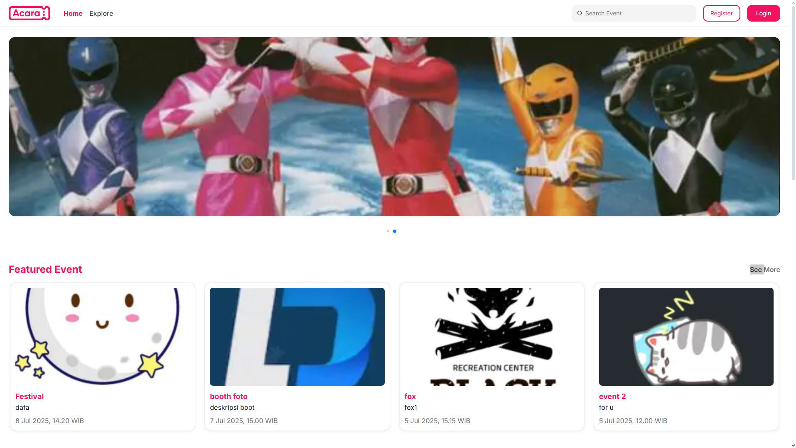

# back-end-acara

## Table of Contents

- [Overview](#overview)  
- [Screenshot](#screenshot)  
- [Getting Started](#getting-started)  
  - [Prerequisites](#prerequisites)  
  - [Installation](#installation)  
- [Usage](#usage)  
- [Testing](#testing)  

---

## Overview

**back-end-acara** is a comprehensive back-end development toolkit built with Node.js, designed to accelerate the creation of modern scalable web applications. It leverages the latest features in Node.js, with built-in support for middleware, route and user management, combined with Midtrans SDK for safely handling any payment system logic.

### Why `back-end-acara`?

This project was developed to:

- 📦 **API Integration & Handling**: Centralized Axios instance and response formatter middleware to streamline communication with third-party services.
- 🔐 **Modern Design Patterns**: Follows SOLID principles with theme-architecture model, context, controller, and services.
- 🔑 **Secure Routing & Middleware**: Role-based access control and authentication for transparent request handling.
- ⚙️ **Type Safety & Configuration**: TypeScript typed and environment config powered clean structure, logs, and modular separation.
- 🧩 **Reusable UI Components & Layout**: Modular components like AppShell, DataTable, and Toaster enhance development efficiency.
- 🎯 **Custom-built Utilities**: Helpers for debouncing, result handling, URL management, and more optimize user interactions.

---

## Screenshot

Example of the app interface:



---

## Getting Started

### Prerequisites

This project requires the following dependencies:

- **Programming Language**: TypeScript  
- **Package Manager**: `npm`

---

### Installation

Follow these steps to clone the repo and install dependencies:

```bash
# 1. Clone the repository
git clone https://github.com/Lazydavidd/back-end-acara

# 2. Navigate to the project directory
cd back-end-acara

# 3. Install the dependencies
npm install
```

---

## Usage

Run the project with:

```bash
npm start
```

---

## Testing

Unit tests are located under the `test/` directory, using the Jest framework. Run the test suite with:

```bash
npm test
```
